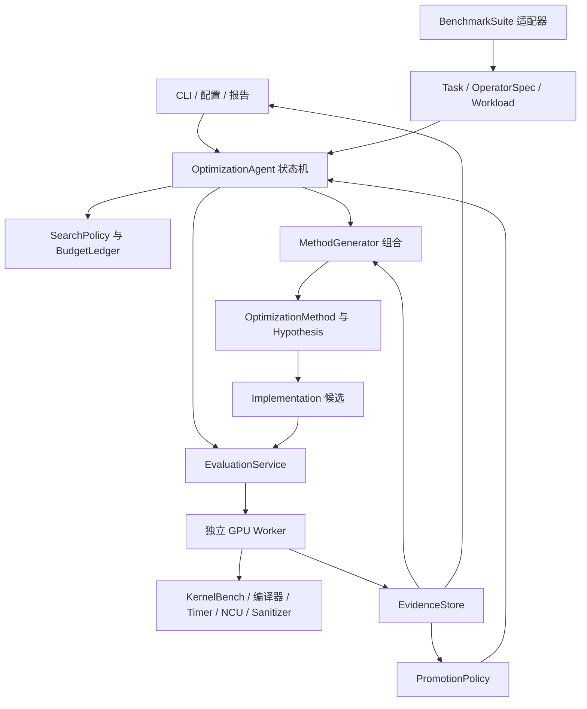
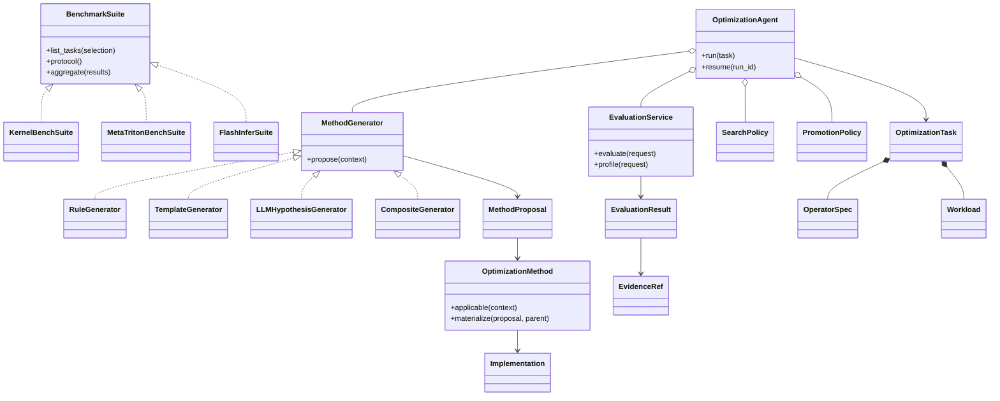
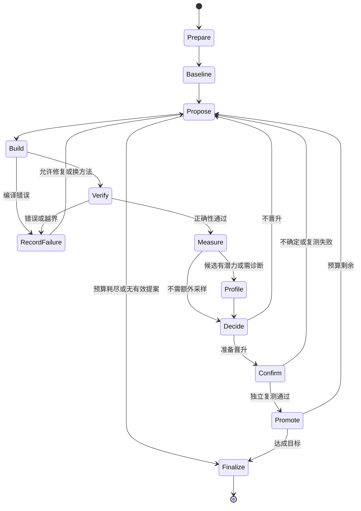

# NVIDIA 算子优化 Agent：调研与详细设计

版本：0.1（设计评审稿）
调研日期：2026-09-12
目标：自动完成优化实验，以可复核证据决定取舍，通过面向对象接口复用已有工具。
交付边界：本次完成项目与源码调研、接口设计和实施方案；未运行 GPU 实验，文中的性能数字与预算均标明为示例或建议，不是实测结果。

## 1. 设计主张

建议建设一个**以实验为核心的优化编排层**：KernelBench 提供首批问题与兼容评测；Triton、CUDA/CUTLASS 提供实现与参数搜索能力；Nsight Compute、Nsight Systems、Compute Sanitizer 提供硬件和运行证据；我们负责对象契约、方法选择、可信执行、证据关联、预算与候选晋升。

首期优先封装 Meta/PyTorch KernelAgent 的生成/优化入口，建立可运行的外部 agent 基线；再按接口逐步复用其 profiler 等组件，并加入参数调优与证据驱动的方法生成器。不能因其已有多 agent 架构就同时维护另一套完整多 agent 系统。上游仍在演进，采用版本固定的适配器比复制仓库后大改更容易持续复用。[S04]

三个核心概念落实为工程约束：

| 核心 | 可执行含义 | 验收方式 |
|---|---|---|
| 自动 | 从任务清单到基线、候选、编译、验证、计时、诊断、迭代、回滚、报告，状态机驱动 | 给定配置后无需人工逐轮干预；超时、重启后有确定状态 |
| 证据 | 每个结论绑定源代码、环境、输入、工具记录和比较对象；事实与假设分开 | 任一晋升均能追溯并重跑；没有硬件证据时不输出硬件归因 |
| 面向对象 | 语义、工作负载、实现、评测、方法、生成器和决策各有责任边界 | 增加一个 benchmark 或 backend 时，优化主循环不变 |

**研究贡献应放在“怎样根据证据选择下一次实验，以及怎样可靠地认定收益”上。** 单纯让 LLM 写代码、跑测试、再改代码，现有项目已经覆盖。可研究的差异是结构化优化假设、可反驳的证据预测、搜索预算分配、多形状约束，以及可复用的方法效果记录。

默认假设：使用 Python 编排；执行端是 Linux NVIDIA GPU worker；先做单 GPU、forward、固定形状/有限形状集合；Triton 为首个自生成 backend，CUDA/CUTLASS 为后续 backend。实际 GPU 型号未给定，所有架构特性必须运行时探测，不能默认具备 Hopper/Blackwell 能力。当前 Windows 工作目录可以承担设计与控制端开发，GPU worker 独立部署。

## 2. 调研范围与证据标准

本次读取项目官方仓库 README、许可证、关键源码及 NVIDIA 官方工具文档。仓库已记录完整 commit；网页保存了本地快照和 SHA-256。源索引见附录和 `research/SOURCES.md`。检索发现项目不等于验证了它的性能；本文不引用未经复现的排行榜收益作为设计依据。

“权威”拆成三项判断：是否有明确维护方与公开研究背景、是否有可执行测试与输入/指标定义、是否能固定版本复现。研究基准不是官方硬件认证，也不能覆盖全部生产负载。特别是 KernelBench 明确表示不背书第三方生成结果。[S01][S02]

当前目录没有既有实现文件，因此下面是新项目架构设计。此次未审查其他本地研究项目，也不假定已有私有工具能直接接入。

## 3. 可复用项目与取舍

### 3.1 评测基准和工作负载

| 项目 | 已核实的能力 | 建议用途 | 接入边界与限制 |
|---|---|---|---|
| **ScalingIntelligence/KernelBench** | ICML 2025 项目；当前 README 列出 L1 100、L2 100、L3 50，以及 L4 Hugging Face 模型类别；随机输入正确性检查、计时、`fast_p`；支持 CUDA/Triton 等 backend | **首期主基准**，L1 起步，随后 L2 | 主分支和 v0/v0.1 不可混用；计数与 ID 以固定快照实际清单为准；L3/L4 涉及图与整模型，不当作单 kernel |
| **meta-pytorch/tritonbench** | PyTorch/Triton 算子性能框架；`BenchmarkOperator`、provider 注册、输入迭代器、指标注册；包含多种实现 | **工程性能回归与强基线** | 不是 KernelBench 同一测试集；默认安装会引入 PyTorch nightly，需独立锁版本；依赖较多 |
| **thunlp/TritonBench** | LLM 生成 Triton 的 G/T 两条评测通道；调用/执行/效率评测；G 还含代码相似度 | 第二阶段外部生成泛化评测 | 不与 Meta 的同名项目混淆；CodeBLEU 不作为性能或语义正确性依据；代码版本和数据许可分开核验 |
| **flashinfer-ai/flashinfer-bench** | `Definition`、`Workload`、`Solution`、`TraceSet` 与 Benchmark；官方 FlashInfer-Trace 数据 | **第二阶段真实推理工作负载**与对象设计参考 | 数据集另行固定 Hugging Face revision、张量文件 hash；trace 并不自动代表所有线上分布 |
| **NVIDIA/nvbench** | CUDA C++ 参数轴、冷缓存/批量计时、CPU/GPU 时间、吞吐量 | CUDA backend 的微基准执行器 | 它是 harness，不是现成的通用 LLM 算子题库；不能替代 KernelBench 任务定义 |

来源：[S01][S03][S05][S06][S10]。

**选择顺序：KernelBench → Meta tritonbench → FlashInfer-Bench → 清华 TritonBench。** 首期不重新收集 100 个算子、不手写一套平行题库。补充测试只用于契约覆盖和测量可信度，必须标为扩展评测，不冒充原版分数。

### 3.2 已有优化 agent

| 项目 | 实现机制与证据 | 复用建议 | 不宜直接继承的假设 |
|---|---|---|---|
| **Meta/PyTorch KernelAgent** | Triton 生成、验证、子图拆分/组合；优化路径含 NCU、SOL 分析、LLM 瓶颈诊断、beam search 和最佳候选保存；源码有 `KernelProfiler`、`OptimizationOrchestrator` | 首先用外部进程适配器跑通完整入口；统一复验其输出。随后评估抽取 profiler/提示模板 | 自生成测试的 PASS 不能替代独立验证；SOL 阈值不能证明算法最优；部分 profiler 路径取最后一个 launch，不能泛化到多 kernel 程序 |
| **NVlabs/kda** | 早期研究工作流：任务契约、独立工作区、迭代、profiling、候选记录与晋升；组合 KernelWiki/ncu-report-skill | 复用记录约定、任务契约和知识组织；作为工作流参考 | 不是即插即用的统一 benchmark 执行服务；wishlist 的 B200/B300 范围不等于本项目的硬件范围 |
| **mit-han-lab/ncu-report-skill** | `.ncu-rep` Python API 分析、stall 热点、harness 模板、诊断参考；针对 B200 指标优化 | 优先评估其分析脚本作为 `ProfileParser` 后端，节省报表解析工作 | A100/H100 等指标名和硬件行为要单独映射；不要将 B200 阈值推广到所有 GPU |
| **ScalingIntelligence/caesar** | KernelBench 多轮生成状态机，反馈 correctness、runtime、Torch Profiler；`state_machine.py` 和 `transitions_def.py` | 对照基线和状态机设计参考 | 当前 README 把 NCU 列为未来功能；不能宣称它已提供完整 NCU 闭环；许可待确认后再嵌入代码 |
| **BytedTsinghua-SIA/CUDA-Agent** | 公开 README、Ops-6K 训练数据、agent 工作目录；分开的编译、验证和性能脚本；项目是 agentic RL 路线 | 借鉴工作区和验证分层；以后研究方法先验或训练数据 | 不等于已公开全套训练和部署能力；本次仓库元数据未给出许可证，不纳入默认可分发依赖；论文收益视为作者报告 |

来源：[S04][S07][S08][S09][S11]。

建议把“现成 agent 整体适配”和“自有方法生成器”看成两种可以比较的策略入口。允许外部 agent 自己迭代，但它的所有内部 GPU 时间和模型调用也计入预算，最终代码必须交给同一个可信 evaluator。只比较其最终文件、忽略内部搜索成本，会失去公平性。

### 3.3 编译、模板、调参与 NVIDIA 工具

| 组件 | 复用内容 | 本项目需补充 |
|---|---|---|
| Triton | `triton.jit`、`triton.Config`、`autotune`、`prune_configs_by`、`testing.do_bench` | 参数空间生成、运行预算、形状/布局 guard、独立复验和环境缓存键 |
| CUTLASS / CuTe C++ | GEMM/卷积模板、layout、MMA/copy 抽象、CUTLASS Profiler | 模板选择与参数实例化适配；将 microbenchmark winner 放回真实 operator wrapper 复测 |
| CuTe DSL | Python 化低层 kernel 表达，与 CuTe 概念接近 | 可选高级 backend；架构和版本能力探测；许可证与 C++ 部分分别管理 |
| Kernel Tuner | `tune_kernel`、配置限制、搜索算法、输出验证与缓存 | 适配 CUDA 可调 kernel 的参数/缓冲区；每次真实评测计入统一预算 |
| TileLang | tile 级 DSL、编译后端、流水线、autotuning | 后续 backend，不首期同时承担三个 DSL 的兼容成本 |
| FlashInfer | attention/GEMM/MoE 等推理实现与 kernel generator | 作为可允许的生产实现和强基线；纯生成赛道限制下不能偷偷调用 |
| Nsight Compute（NCU） | kernel 硬件计数器、section、roofline、source/SASS 关联、报告导出 | 指标规范化、缺失值语义、launch 对齐、证据到方法映射 |
| Nsight Systems（NSYS） | CUDA/API/NVTX 时间线、launch 间隙与重叠分析 | 在多 kernel/主机开销场景按需调用，避免只优化局部 |
| Compute Sanitizer | memcheck、racecheck、initcheck、synccheck | 按候选风险分级调用；结果纳入晋升约束 |
| cuobjdump / nvdisasm | 二进制与 SASS 检查 | 对“用了 Tensor Core/异步拷贝/减少 spill”等特定主张按需取证 |

来源：[S12]–[S20]。NVIDIA profiler/运行库等是官方工具，不应统称为宽松许可的开源组件。CUTLASS 根许可证明确把 `python/CuTeDSL` 放在 NVIDIA EULA 下；不能用 C++ 的 BSD-3-Clause 概括整个发行物。[S13]

NVBench 与 KernelBench/Triton 计时器无需一起强制部署。**复用的是对应 backend 已有的测量实现，统一的是 `TimingProtocol` 和输出语义。** 同理，不要求 Kernel Tuner 直接管理 Triton；Triton 候选使用其原生 autotuner，CUDA 候选按实际入口接 Kernel Tuner 或 CUTLASS Profiler。

## 4. Benchmark 契约与评测组织

### 4.1 三种运行轨道

| 轨道 | 用途 | 约束 |
|---|---|---|
| `upstream_compatible` | 和固定版本 KernelBench 协议对照 | 不改变问题源、输入生成逻辑、原版误差规则；显式记录计时方法、trial 数、baseline 模式、精度及规则版本。协议不一致就不能称为可直接比较 |
| `robustness_extended` | 检验真实可靠性 | 在原契约允许范围补随机输入、边界形状、stride/alias/特殊值测试；额外维度单独报告 |
| `production_reuse` | 实用性能与部署 | 可用白名单库、dispatch、多 kernel；对照 eager、compile、库实现；记录库调用。不得混入有禁止调用约束的纯生成赛道 |

“复用基础工具”与“候选能否调用库”是两件事。所有轨道都可复用编译器、harness、profiler；生成结果能否调用 cuBLAS/FlashInfer/PyTorch 必须由任务规则确定，agent 无权放宽。

### 4.2 四级任务粒度

`OperatorSpec` 表示数学与调用语义；`Workload` 表示一次具体输入配置；`OptimizationTask` 表示在目标硬件和预算下优化哪些 workload；`BenchmarkSuite` 定义清单与评分。

例如“矩阵乘法”是 OperatorSpec；M/N/K、dtype、stride、数据分布是 Workload；“在指定 GPU 上优化 12 个形状，workspace 不超过阈值”是 Task；“KernelBench 某 SHA 的 L1 固定清单”是 Suite。

不要把算子 ID 等同于 GEMM/ReLU 标签：KernelBench 一个问题可能是融合子图或完整模型。用 `granularity = operator | subgraph | model` 表示粒度，并让实现对象容纳多个 kernel、host wrapper 和 dispatch。

### 4.3 首批清单

直接调用 KernelBench `BaseDataset.get_representative_subset()` 构建开发清单，生成并冻结实际包含的 ID。当前源码为 L1 预设 18 个 ID、L2 8 个、L3 9 个，且会过滤不存在的 ID；这只是开发子集，不是额外“官方榜单”。[S01]

实施顺序：L1 代表子集验证执行链 → 固定 L1 全量 → L2 融合 → Meta tritonbench 的 GEMM/归约等对应 workload → FlashInfer-Trace。正式全量实验前冻结清单与排除条件；不能跑完再删掉困难问题。

训练/检索资料与测试隔离：公开 benchmark 可能已经进入基础模型训练，无法保证绝对无污染。应记录模型标识、是否检索测试答案、知识库文档列表；正式评测禁止检索当前测试的已优化解；使用未参与调参的 workload/形状扩展作为补充，不声称消除了预训练污染。

## 5. 面向对象架构

### 5.1 分层与依赖方向



Domain 层不 import torch/CUDA，不依赖某种模型 SDK。Application 层编排领域对象。Infrastructure 层适配上游工具。生成器只能提出计划和实现，不能自行签发“正确”与“晋升”结果。

### 5.2 核心对象职责

| 对象 | 所有的数据/行为 | 明确不承担的职责 |
|---|---|---|
| `OptimizationAgent` | 接受 Task、驱动状态机、持久化进度、调度下一步 | 不直接写 ncu 命令解析，不内嵌所有优化技巧 |
| `BenchmarkSuite` | 来源版本、问题清单、协议、结果聚合；创建 Task | 不生成优化代码，不根据当前分数改变任务集合 |
| `OperatorSpec` | 输入输出与状态语义、reference、合法域、误差/精度、alias/in-place 规则 | 不保存“当前最快实现”；速度不是算子语义 |
| `Workload` | 具体 shape/stride/layout/dtype/scalar、输入生成器/张量引用、权重 | 不在控制进程持有 GPU Tensor |
| `Implementation` | 一份不可变代码包、入口、backend、build spec、能力 guard、来源 | 不自己声称 correctness；支持一到多个 kernel |
| `OptimizationMethod` | 可执行变换或搜索方法、前提、参数空间、适用范围、预期证据、材料化逻辑 | 不保存每次运行的隐式全局状态 |
| `MethodGenerator` | 根据 Task、父候选和证据生成 `MethodProposal` | 不等同于代码生成器；可以返回模板/调参/复用方案 |
| `SearchPolicy` | 从提案中选实验、分配预算、维护候选前沿 | 不读取任意 stdout 就认定成功 |
| `EvaluationService` | 编译、验证、计时、profiling 的受控请求与结构化结果 | 不依赖 LLM 自评，不能被候选修改规则 |
| `PromotionPolicy` | 校验硬约束、确认性能、更新 champion | 不生成代码；任何 tie/inconclusive 有显式状态 |
| `EvidenceStore` | 追加原始证据与索引、关联 hash、查询和报告 | 不把模型分析文本转换为硬件计数器 |
| `HardwareTarget` | GPU UUID、SM 能力、内存、驱动/工具链能力与策略 | 不仅靠“GPU 型号字符串”选择实现 |

### 5.3 关系与设计模式



使用 Adapter 接第三方；Strategy 替换生成/搜索/晋升策略；Repository 管理证据与状态；组合生成器实现方法组合。抽象优先用 Python `Protocol`，只有确实需要共享模板流程时才用 ABC。不要做 `GemmAgent → H100GemmAgent → TritonH100GemmAgent` 的继承树：算子、硬件和 backend 是独立维度，应该组合。

为每个 benchmark 问题造一个 Python 子类也不合适。大多数语义可由不可变描述对象表达；只有输入生成、状态恢复、非标准输出比较等存在行为差异时，才实现对应策略接口。

### 5.4 关键接口草案

下面是**接口草案，不是已经实现的 SDK**。省略具体 schema 字段的对象用前向引用表示；实现时补 Pydantic 边界验证、JSON Schema 和版本迁移。Domain 中使用 frozen dataclass + tuple，避免“frozen 外壳包住可变 dict”的伪不可变。

```python
from __future__ import annotations
from dataclasses import dataclass
from typing import Iterable, Literal, Protocol

@dataclass(frozen=True)
class EvidenceRef:
    artifact_sha256: str
    kind: str
    producer_version: str

@dataclass(frozen=True)
class Implementation:
    content_sha256: str
    operator_id: str
    backend: str
    entry_point: str
    build_spec_sha256: str
    applicability_guard_sha256: str
    parent_ids: tuple[str, ...]

@dataclass(frozen=True)
class Hypothesis:
    statement: str
    supporting_evidence: tuple[EvidenceRef, ...]
    predicted_observations: tuple[str, ...]
    falsification_conditions: tuple[str, ...]

@dataclass(frozen=True)
class MethodProposal:
    method_id: str
    method_version: str
    hypothesis: Hypothesis
    parameter_space_sha256: str
    estimated_gpu_seconds: float
    target_workload_ids: tuple[str, ...]

@dataclass(frozen=True)
class EvaluationResult:
    candidate_id: str
    protocol_sha256: str
    environment_sha256: str
    status: Literal["passed", "incorrect", "build_failed", "timeout",
                    "resource_exceeded", "unsupported", "inconclusive"]
    evidence: tuple[EvidenceRef, ...]

class BenchmarkSuite(Protocol):
    def list_tasks(self, selection: Selection) -> Iterable[OptimizationTask]: ...
    def protocol(self) -> EvaluationProtocol: ...
    def aggregate(self, results: Iterable[TaskResult]) -> SuiteReport: ...

class MethodGenerator(Protocol):
    def propose(self, context: OptimizationContext) -> Iterable[MethodProposal]: ...

class OptimizationMethod(Protocol):
    def applicable(self, context: OptimizationContext) -> Applicability: ...
    def materialize(self, proposal: MethodProposal,
                    parent: Implementation | None,
                    services: GenerationServices) -> Iterable[Implementation]: ...

class EvaluationService(Protocol):
    def evaluate(self, request: EvaluationRequest) -> EvaluationResult: ...
    def profile(self, request: ProfileRequest) -> ProfileResult: ...

class PromotionPolicy(Protocol):
    def decide(self, incumbent: EvaluationResult | None,
               challenger: EvaluationResult,
               confirmation: EvaluationResult) -> PromotionDecision: ...

class OptimizationAgent(Protocol):
    def run(self, task: OptimizationTask) -> TaskResult: ...
    def resume(self, run_id: str) -> TaskResult: ...
```

返回类型 `Applicability` 必须包含适用/不适用/未知及原因。`unknown` 触发廉价能力探测，不自动等同于适用。`GenerationServices` 只给受限的模型、模板检索和参数枚举能力；涉及 GPU 的 autotune 子实验由统一 EvaluationService 执行并入账。

`EvaluationResult` 是一次执行结果，`TaskResult` 是整个搜索的终态；候选正确但没有加速时，仍是有效候选，任务终态可为 `completed_no_improvement`。明确区分“搜索结束”和“找到更快实现”。

## 6. 方法生成器：把技巧转成可实验对象

### 6.1 方法的六个组成部分

一个方法至少包含：适用前提、变换/模板、可调参数、预计影响、风险/验证要求，以及来源。`MethodProposal` 是本次应用计划；`OptimizationMethod` 是可复用能力；`Implementation` 是实际生成物；`Experiment` 是对生成物的一次评测。这四者不能合并成一段 prompt。

例如 `TuneLaunchConfig` 使用已有 Triton autotune；`InstantiateCutlassGemm` 选用已有 CUTLASS 模板；`FuseEpilogue` 生成语义保持的融合实现；`ReuseLibraryImplementation` 选择允许的现成库。方法生成器先判断已有实现能否满足目标，再决定是否生成新 kernel。

### 6.2 生成器组合

1. `ReuseGenerator`：查找已验证、许可和契约兼容的实现；建立强基线或直接构建候选。
2. `TemplateGenerator`：从 Triton/CUTLASS 等模板实例化，参数化 shape/layout/精度；保留出处。
3. `RuleGenerator`：依据硬件计数器与时间线提出有限方法，如修正访存、融合、调整 tile。
4. `LLMHypothesisGenerator`：在以上不足时，用代码、约束、原始指标摘要和失败历史生成结构化假设及代码变换计划。
5. `CompositeGenerator`：去重、检查前提、分配预算；不是把所有生成器输出全部执行。

`ExternalAgentStrategy` 包装上游 KernelAgent 的完整搜索，属于较粗粒度策略，不强行伪装成一次便宜的 Method。它返回候选和成本轨迹；无法观测内部实验时，报告预算粒度差异，不能进行严格的逐候选等预算比较。

### 6.3 初始方法注册表

| 方法 ID | 前提与证据线索 | 优先使用的工具 | 预期观察与主要风险 |
|---|---|---|---|
| `reuse.library` | 轨道允许；语义/精度/布局匹配 | FlashInfer、PyTorch/厂商库 provider | 稳定强基线；wrapper 转换成本可能抵消收益 |
| `launch.autotune` | 已正确；存在 block/warp/tile 参数 | Triton autotune / Kernel Tuner | 改善延迟；寄存器与 occupancy 可能反向变化 |
| `memory.coalesce` | 访问模式与 transaction/sector 数据支持不合并访存 | DSL layout/索引模板 | 减少实际内存事务；检查越界、mask、stride |
| `memory.vectorize` | 对齐/连续性 guard 成立 | CUDA/Triton 模板 | 指令/事务改善；尾部和非对齐输入风险 |
| `fusion.epilogue` | 时间线存在可消除 launch/中间张量 | Triton 或 CUTLASS epilogue | launch/中间流量减少；寄存器增加，组合语义风险 |
| `reduction.hierarchical` | 长归约或跨 block 扩展需求 | Triton/CUDA 归约模板 | 并行度改善；归约顺序影响精度，多阶段增加流量 |
| `gemm.tile_pipeline` | GEMM 可识别，目标支持对应机制 | CUTLASS / 原生 autotune | tensor pipe/访存重叠改善；shared memory 与寄存器超限 |
| `gemm.split_k` | 输出 tile 并行度不足且 K 大 | CUTLASS/已有模板 | 并行度改善；workspace、额外归约、原子非确定性 |
| `persistent.schedule` | 小规模/不均匀 tile、调度证据支持 | 已有 persistent 模板 | tail/调度开销下降；不保证所有形状获益 |
| `async.pipeline` | 硬件支持且 load/compute 可重叠 | CUTLASS/CuTe 模板 | stall/重叠变化；barrier 正确性，架构专属能力 |

这些是候选方法，不是“看到某指标就必然使用”的规则。低 occupancy 并不必然慢；高 bandwidth 也不证明已经最优；LLM 提供的是可检验假设。

### 6.4 搜索策略

首期用 best-first / 小 beam：保持最多 3 个质量与方法族有差异的父候选，每轮提出 2–4 个实验（建议初值）。保留全局 champion，未确认的快候选不能覆盖它。优先修复正确性，再做便宜的参数搜索，再做结构变换；每轮只改变一个主要因素，复合变换必须记录全部因素。

排序可用 `预期延迟收益 × 成功概率 / 预计成本` 加探索项，但数值仅是启发式评分，不能解释成统计校准概率。后续积累数据后再比较 bandit、贝叶斯搜索或进化搜索是否有价值。

方法历史按“算子族 + 硬件能力 + shape/layout/dtype + 父实现”检索，保存失败与无收益记录。不要把一次 H100 上的成功写成适用于所有 NVIDIA GPU 的规则。检索结果同时显示来源、验证范围、软件版本和反例。

## 7. 自动执行状态机与故障恢复



所有状态都可被取消或资源超时终止；prepare/baseline 失败分别记录 `unsupported` 或 `baseline_failed`，不继续生成无法解释的分数。图中省略这些横向终止边，落地时需要覆盖。

每一步采用“写意图 → 执行 → 原子保存 artifact → 写完成事件”。`experiment_id` 和请求 hash 作为幂等键。恢复时检查状态、artifact hash、协议/环境兼容性；已有完整结果可复用，只有开始事件没有结束事件的 GPU 执行标为 interrupted 后重跑，不能猜测结果。

错误策略：

| 错误 | 自动处理 | 对结果的影响 |
|---|---|---|
| 语法/编译失败 | 将受限长度的日志反馈给原方法，最多建议 2 次修复 | 每次消耗计入预算；保留失败 |
| 数值错误 | 保存失败输入引用和误差摘要，修复或换方法 | 禁止计入正确/加速候选 |
| 超时/死锁/非法访问 | 终止进程组，废弃 CUDA context；健康检查后新进程 | GPU 异常持续时隔离 worker，不盲目重跑 |
| OOM/资源限制 | 标记资源超限；可缩小 tile/workspace 参数 | 不降低题目大小或放宽正确性 |
| NCU 权限/指标缺失 | 标记 profile unavailable，继续受允许的计时搜索 | 可认定性能收益；不能宣称硬件机制已证实 |
| 计时抖动/设备被占用 | 有预算则延迟或重测；否则 inconclusive | 不挑最小值晋升 |
| 模型服务失败 | 有限退避；保存 request ID | 成本与故障分开统计 |

停止条件包括预算、明确性能目标、没有新的适用方法、连续若干轮确认无改进。**不能仅因 SOL ≥ 95% 自动宣布优化完成或达到理论最优。** SOL 可用于调整探索优先级，但融合、减少总工作量或替换算法仍可能提高性能。[S04][S16]

## 8. 现有工具的具体接法

### 8.1 KernelBenchSuite / KernelBenchEvaluator

已核对当前源码路径：`src/kernelbench/dataset.py`、`eval.py`、`timing.py`。README 某些文字仍指向旧的 `src/eval.py`，接入应以固定 SHA 源码为准。[S01]

| 我们的接口 | 上游入口 | 适配内容 |
|---|---|---|
| `list_tasks()` | `construct_kernelbench_dataset`、`BaseDataset`、`Problem` | 保留 level/problem_id/code；追加原始 SHA-256、suite revision、任务规则 |
| reference 输入 | `Model`、`get_init_inputs()`、`get_inputs()` | 仅 worker 动态加载；固定参数状态/随机种子，记录实际输入 metadata |
| 候选入口 | `ModelNew` | backend wrapper 保持初始化与 forward 契约；不能只测试内部 kernel |
| 快速兼容评测 | `eval_kernel_against_ref(...)` | 外层进程超时、资源限制；规范化 `KernelExecResult` 与异常 |
| baseline | `timing.measure_ref_program_time(...)` | 分开记录 eager 和 compile；计时协议完全一致 |
| 计时实现 | `get_timing_function(...)` | 根据明确协议选择 cuda_event/do_bench/host_time；不混用数值 |

下面调用签名已与本次源码核对，参数值是示例；必须在隔离 GPU worker 中执行。该函数提供上游检查，不代表已经具备第 9 节所有增强保护。

```python
import torch
from kernelbench import eval as kb_eval

result = kb_eval.eval_kernel_against_ref(
    original_model_src=reference_source,
    custom_model_src=candidate_source,
    seed_num=42,
    num_correct_trials=5,
    num_perf_trials=100,
    measure_performance=True,
    timing_method="cuda_event",
    build_dir=isolated_build_dir,
    device=torch.device("cuda:0"),
    backend="triton",
    precision=torch.float32,
)
```

`seed_num=42` 只用于展示接口；搜索与最终复验必须使用预先分配且独立的种子集合。函数默认 correctness trial 数为 1，CLI 默认是 5；不能靠默认值复现。其精度转换、TileLang 支持范围以及 Model 参数处理也受版本影响，应由适配器能力测试锁定。

首期先保留上游评测路径获得可对照结果，再添加独立增强 validator。不要为了增加一个检查直接复制整份 `eval.py`。确需 patch 时用小型版本化补丁，并在结果中同时保存 upstream SHA 和 patch SHA。

### 8.2 MetaTritonBenchSuite

复用 `tritonbench.load_opbench_by_name()` 和 `BenchmarkOperator`。算子类通过 `@register_benchmark` 注册 provider，`get_input_iter()` 给 workload，`@register_metric` 给指标；GEMM 源码可作为首个接入参考。[S03]

将生成结果包装成 provider，和现有 provider 同一输入、同一模式比较。上游框架已经负责输入轴和多个 baseline，不重新实现其整套注册体系。我们只导出 domain 描述并接受标准化结果；反向/训练模式暂时禁用，并显式写进 task contract。

### 8.3 FlashInferSuite

映射关系：`Definition → OperatorSpec`；`Workload → Workload`；`Solution → Implementation`；`TraceSet → SuiteSnapshot`；上游 `Benchmark` 留在适配器内部。[S06]

已核对 `Definition` 含 axes、inputs/outputs、reference、constraints；`Solution` 含代码文件与 `BuildSpec`；`Workload` 含 axes、输入描述和 UUID。直接复用其 schema 和导入导出能力，在外围增加证据和任务约束，不再发明一套功能相同的交换格式。

接入时注意两点：一是 `destination_passing_style` 决定候选接收预分配输出还是返回输出；二是当前 `BuildSpec.target_hardware` 文档注明尚未用于验证和构建，因此本项目仍需真实的能力 guard。已有 `Solution.hash()` 不包含本项目全部环境/协议维度，不可单独作为实验缓存键。

最小上游运行示例：

```python
from flashinfer_bench.bench import Benchmark, BenchmarkConfig
from flashinfer_bench.data import TraceSet

trace_set = TraceSet.from_path(pinned_dataset_path)
config = BenchmarkConfig.default(warmup_runs=10, iterations=100, num_trials=5)
benchmark = Benchmark(trace_set, config)
benchmark.run_all(save_results=True)
```

trace 的下载属于 prepare 阶段；运行候选前完成离线缓存，执行时不临时联网获取依赖。误差阈值以任务定义为准，不为了过测把示例容差写到所有算子上。

### 8.4 编译与 autotune

`TritonBackend` 用 `triton.Config` 表达 tile/warp/stage 空间，并复用剪枝机制。调参可能反复更新输出，原生 autotune 提供 `reset_to_zero`/`restore_value`；输入别名与状态仍需由 harness 维护。最终选定配置后关闭动态搜索，单独复验固定配置的实现。[S12]

`CudaBackend` 可用 PyTorch C++ extension 或特定 benchmark 原有 binding；首期沿用 benchmark 入口减少 glue code。`KernelTunerAdapter` 只负责可表示的 kernel 参数搜索；若其内部 timing 与正式协议不同，其结果仅用于筛选，winner 重新经过统一 evaluator。[S14]

`CutlassBackend` 先用 CUTLASS Profiler 找可用模板/配置，再材料化完整 wrapper。Profiler 的 GFLOP/s 不能直接等于算子端到端收益，布局转换、workspace 清零和归约阶段必须在正式范围中处理。[S13]

## 9. 正确性、测量与可信评测

### 9.1 正确性的层次

第一层检查编译与 ABI、输出数量/shape/dtype/device；第二层按 reference 验证数值与状态；第三层按契约抽样检查边界和输入扰动；第四层按风险调用 Compute Sanitizer；最终候选再用未参与搜索的种子/工作负载进行确认。

必须明确定义：TF32 是否允许、输入/累加/输出精度、fast-math、确定性要求、NaN/Inf 行为、误差容忍、in-place 和 alias、stride 合法域、初始化参数及状态更新。不是所有算子都要求 NaN/Inf 或非连续输入；只在声明支持的域内检验，域外拒绝或走明确 fallback。

数值比较可以复用 `torch.testing.assert_close` 或 benchmark 原生比较器，但每种输出需匹配其语义；归约、近似函数、整数输出分别处理。记录最大绝对/相对误差、失败比例与失败输入引用；近零值的相对误差必须有合理分母规则。有限随机测试提供经验保证，不是形式证明。

Sanitizer 的 `racecheck` 主要检查 shared-memory 数据竞争，不能当作一般并发正确性证明；其他工具也有覆盖范围。Sanitizer/profile 的运行不参与正式延迟测量。[S18]

### 9.2 候选和 evaluator 的信任边界

代码生成物可以修改 Python 对象、计时接口或文件，因此“由候选自己打印 PASS”不够。可信父服务持有 manifest、reference hash、结果数据库和最终晋升权限；候选只得到输入、允许的运行依赖及私有构建目录。

建议 Linux worker 在一次性容器/进程中执行，候选不可写 reference、evaluator 与证据目录，不注入模型 API 凭据；依赖先准备，评测时禁网络。读取公共 reference 是生成任务的一部分，不需要假装把数学语义藏起来；需要保护的是 evaluator 状态、期望输出和最终测量逻辑。

进程隔离本身不能阻止同进程 Python monkey patch。上游兼容路径必须标注其信任边界；增强路径由可信驱动控制输入生成、reference 执行、输出比较与计时，候选只暴露约定入口，结合静态检查、实际启动 kernel 观察、输入突变检查及独立重跑。高对抗场景进一步使用独立进程/原生 harness；即使如此也不宣称可完美防御任意恶意 GPU 程序。

不可将候选可写目录中的 JSON 直接当可信结果。父 evaluator 校验 schema、request ID、候选/协议 hash，并由自身写入结果。输入重复值、缓存答案、修改输入、切到未被计时 stream 等已是 KernelBench 明确关注的问题。[S02]

### 9.3 计时契约

默认目标为**已预热的 operator 入口 GPU 延迟**：输入在 GPU；JIT 编译、外部 autotune、数据下载不在热执行时间内，但单独计成本；实际执行必需的转换/拷贝/归约不可移出测量。权重常驻等预处理是否允许，要在契约中定义并单列 setup 成本。

同时可选报告同步 host 端到端延迟，以识别 launch、dispatch、Python wrapper 开销。CUDA Graph 是另一种协议，不与普通 event timing 直接混用；baseline 和 candidate 必须同样 capture/预热。多 stream 时需要明确完成依赖，不能只在默认 stream 放两个 event 就认为覆盖了所有工作。

每份 `TimingProtocol` 固定：warmup、试验批次、每批迭代、缓存状态、输入轮换策略、stream/graph 策略、同步点、计时范围、统计量、异常值处理。冷缓存与热缓存分别报告，不选更有利的一种。

GPU worker 独占测量租约；生成和 CPU 编译可并行，同一物理 GPU 上的 benchmark/NCU 默认串行。MIG 实例依然可能共享部分资源和功耗条件，不能自动视为独立无干扰。记录功耗上限、时钟策略、温度、利用率、MIG/MPS/ECC 状态；没有设置权限时记录实际值，不声称已经锁频。

### 9.4 统计比较与晋升

搜索阶段用短测量筛选，确认阶段用预先固定的更长协议。候选与 incumbent 的 A/B 顺序随机或交错，每个独立 batch 得到延迟统计量；bootstrap 的单位是独立 batch，而不是把同一热循环的迭代当成独立样本。

令 `S = T_incumbent / T_candidate`。建议初始晋升规则是：正确性/资源/guard 全部通过，且确认实验的 S 的 95% 区间下界大于 `1 + δ`。`δ=0.02` 可作为开发初值，实际应由 baseline 重复测量的噪声和应用需要校准；这些参数是本设计建议，不是 KernelBench 官方规则。

置信区间用于表达测量不确定性，不证明“95% 概率更快”。大量自适应搜索存在 winner's curse；最终使用独立确认批次并限制重复窥视。跨很多候选的显著性声明需要多重比较处理；首期优先诚实报告确认区间和重复实验，而不是包装成统计最优。

多 workload task 默认要求所有必测 workload 正确，按预先固定权重聚合延迟，并限制最差回退。不能只用胜出形状的几何均值。若允许 shape dispatch，要在最终 wrapper 上重测，并记录每个 guard 与 fallback。

### 9.5 Benchmark 指标

按上游定义，`fast_p = (1/N) Σ 1[correct_i ∧ T_ref,i / T_candidate,i > p]`。阈值使用严格大于还是其他边界，以所选源码版本为准；报告中给出实现规则。[S01]

建议同时报告：全清单正确率、编译成功率、fast_1/fast_2、相对 eager 与 compile 的独立 speedup、正确子集几何均值及其覆盖率、每任务模型 token/费用、GPU 秒、time-to-first-correct、time-to-best。失败不从 N 移除；unsupported/基线失败单列，并报告 attempted/eligible coverage，避免悄悄改变分母。

全清单 fast_p 中未产出可验证速度的任务不计成功；如同时发布“仅可运行子集”分数，必须带清单和分母。不同 benchmark 的指标不平均成一个无来源的总分。上游分数与本项目更严格的置信度晋升规则分开呈现。

## 10. 证据驱动诊断与因果边界

### 10.1 证据分层

| 层次 | 内容 | 可以支持的结论 |
|---|---|---|
| E0 来源 | 代码/输入/工具链/协议 hash、父候选、时间戳 | 实验身份与来源可追溯 |
| E1 正确性 | 比较报告、失败样本、Sanitizer、资源检查 | 在已验证范围内符合契约 |
| E2 性能 | baseline/candidate 原始时间批次、环境、确认区间 | 在指定环境和协议下有可重复收益 |
| E3 机制 | NCU/NSYS、SASS、launch 数、访存/指令变化 | 观察到与某优化机制一致的变化 |
| E4 归因 | 单因素消融、控制条件、反例 | 该机制对收益有更强支持，仍受实验范围限制 |

E1+E2 足以在基本轨道认定性能晋升；E3/E4 决定能否声明机制。用户选择 `explanation_required` 时可要求 E3，profile 不可用则输出“性能有效、解释证据不足”，而非捏造解释。E0–E4 是本项目的证据分类，不是外部标准。

### 10.2 NCU 接入策略

prepare 阶段查询 `ncu --version`、`--list-sections`、`--query-metrics`，由 `MetricCatalog` 选择本机支持的最小指标集。不要给所有 GPU 固定一组 Blackwell 指标名。[S16][S17]

第一层采集 launch、资源、计算/内存吞吐等轻量 section；第二层根据瓶颈补 Memory Workload、Scheduler/Warp State；需要归因时再采 source/SASS。以 NVTX range、kernel 符号、launch 序号、grid/block、代码 hash 关联候选；多 kernel 实现必须识别全部相关 launch，不能简单拿最后一个 kernel 代表算子。

命令形式示例（在 worker 中，section 名与参数先按本机版本确认）：

```bash
ncu --version
ncu --list-sections
ncu --query-metrics
ncu --target-processes all --set basic -o profile/candidate python profile_entry.py
ncu --import profile/candidate.ncu-rep --page raw --csv
compute-sanitizer --tool memcheck python verify_entry.py
```

原始 `.ncu-rep` 是首要 artifact；CSV/JSON 是派生物。优先复用上游 profiler 或 ncu-report-skill 的 `ncu_report` 解析逻辑，外加我们自己的 schema、launch 关联和缺失值处理。单位与完整 metric 名保留，避免将 bytes/sector、active/elapsed 百分比混淆。

NCU 可能 replay、改变 cache/clock 策略并序列化 launch；由此得到的 duration 不用于正式速度排名。正式 timing 在 profiler 外独立执行，profile 配置完整保存。NSYS 用于多 kernel/CPU 调度分析，不能用 NCU 单 kernel 吞吐量解释全部端到端时间。[S16][S19]

### 10.3 Roofline 的正确用法

对指定工作量，初步估计 `T_lower ≈ max(F/P, B/BW)`，其中 F 是与实现/精度匹配的运算量，B 是明确层级的流量。实际执行还受 launch、依赖链、tile 并行度、同步、资源限制影响。融合与算法变换会改变 F/B，不能一直用原算子的固定下界判断所有候选。

分别保存算法必要字节数与 profiler 观测字节数；HBM/L2/shared 层级不能混用。峰值要匹配精度、dense/sparse、指令类型和时钟条件；可用已知 microbenchmark 校准可达带宽，但也要说明测量范围。SOL 百分比是诊断信号，不是完整的 roofline 证明。

### 10.4 消融和方法记忆

若候选同时改变 tile 与融合，至少比较原始、只改 tile、只融合、二者同时四个组合（预算允许时）。如果撤销变换后无法编译或引起其他结构变化，标记该消融不可识别，不能宣称已精确拆分贡献。

记忆库只接受有 artifact 引用的经验项：前提、方法版本、硬件、workload 范围、性能确认、机制证据、失败案例。无 E3/E4 时记录“此配置有效，原因待确认”；模型输出的长篇解释不自动升级为知识。

## 11. 数据与可复现产物

### 11.1 三类 hash

`implementation_id` 对规范化文件清单、文件原始字节、build spec、入口和 guard 取 SHA-256；`evaluation_key` 再加入 workload、验证/计时协议、环境、工具版本；`experiment_id` 标识本次独立执行，即便 key 相同也能保存多次复测。

不能只用算子名、shape 或源代码 hash 缓存结果。驱动、GPU、编译选项、TF32、计时范围任一变化都可能改变结果；编译 cache 与正确性 cache、计时 cache 分开管理。模型请求和检索来源也版本化，但不必进入相同实现的数学身份。

### 11.2 运行目录

```text
runs/<run_id>/
  manifest.json                 # suite/tasks/protocol/预算/模型标识
  environment.json              # GPU、驱动、镜像 digest、工具版本
  events.jsonl                  # 追加状态事件，含 seq 和请求 ID
  tasks/<task_id>/
    task.json
    baseline/                   # eager、compile、可用强基线
    candidates/<content_hash>/
      source/                   # 完整代码包，固定后只读
      build.json
      provenance.json
    experiments/<experiment_id>/
      request.json
      build.log
      validation.json
      timing_samples.json
      profile.ncu-rep
      profile_metrics.json
      analysis.json
      decision.json
    final/                      # 导出的 champion 或明确的无改进结果
      implementation.json
      report.md
  summary.json
  report.md
```

没有运行某工具时不造空的成功报告；`not_collected`、`unavailable`、`failed` 分开。日志摘要可截断，原始文件保留并记录 hash。工作负载张量太大时使用内容寻址对象存储/原始数据集引用，不强制复制全部张量进 run。

### 11.3 实验记录示例

以下为**合成示例**，数值与 ID 均不代表实测；工程实现应使用完整内容 hash。

```json
{
  "schema_version": "1.0",
  "experiment_id": "example-exp-0007",
  "candidate_id": "example-candidate-B",
  "parent_candidate_id": "example-candidate-A",
  "task_id": "example-fused-elementwise",
  "method": {"id": "fusion.epilogue", "version": "1"},
  "hypothesis": {
    "claim": "融合可减少中间张量流量与 launch 开销",
    "evidence_refs": ["example-baseline-timeline"],
    "predictions": ["相关 launch 数减少", "外部计时延迟下降"],
    "falsifiers": ["独立复测无收益", "寄存器压力抵消收益"]
  },
  "validation": {"status": "passed", "case_count": 20},
  "measurement": {
    "protocol": "example-warm-gpu-event-v1",
    "incumbent_median_us": 10.0,
    "candidate_median_us": 8.0,
    "speedup": 1.25,
    "confirmation_interval": [1.20, 1.29]
  },
  "decision": {
    "promotion": "accepted",
    "mechanism_status": "consistent_with_observations",
    "ablation_status": "not_collected"
  }
}
```

MVP 用 SQLite 保存元数据/索引，文件系统保存 artifact；对象存储是后续扩展。事件由单一协调写入器序列化；多机才迁移 Postgres/对象存储。无需一开始上向量数据库、分布式消息系统和复杂 dashboard。

## 12. 部署、预算与复用边界

### 12.1 控制端与执行端

控制端运行 agent、模型接口、生成队列、实验数据库；GPU worker 运行版本固定的容器，执行编译/验证/计时/NCU。单机先用本地进程队列实现 transport；远程可换受控 RPC/作业系统，领域接口不变化。

每个任务有 wall-clock、GPU 秒、LLM token/费用、候选数、编译时长、profile 时长、修复次数上限。启动动作前预留预算，结束后以实际值结算；autotune 的每组真实试跑也要计费。超预算不会自动换大 GPU 或增购算力。

LLM 并发、CPU 编译并发与 GPU 测量并发分别配置。一个逻辑 Agent 足以组织 MVP，不要求多个独立 LLM agent；需要平行提出方案时可以配置生成 worker，但计时仍按 GPU 租约隔离。

### 12.2 建议初始预算

开发示例可设每任务 20 个生成候选、30 分钟 wall-clock、最多 3 次深度 profile，预留约 20% GPU 时间给最终确认。数值仅用于先跑通，不是预计能达到的性能或通用最佳预算。参数调优内部配置次数另设上限，例如 64；不能把 64 次测量记成 1 次实验。

遇到编译重、模型调用贵或 NCU 开销高的任务，记录成本曲线后调整。正式对比采用一致的资源约束，并同时报告墙钟和 GPU/模型成本，不能只比较迭代轮数。

### 12.3 依赖策略

| 层 | 首期依赖 | 固定方式 |
|---|---|---|
| 任务与协议 | KernelBench | commit + 适配器版本；输入/问题 hash |
| 首个外部策略 | Meta/PyTorch KernelAgent | commit + 单独依赖环境；统一复验输出 |
| 自生成 backend | PyTorch + Triton | 精确版本和 wheel/container digest |
| NVIDIA 工具 | 驱动、CUDA、NCU、Sanitizer | 环境指纹与能力探测；驱动在宿主侧记录 |
| 数据/验证 | dataclass/Pydantic、SQLite、pytest | 项目 lockfile |
| 第二阶段 | Meta tritonbench、FlashInfer-Bench、Kernel Tuner、CUTLASS | 各自环境/版本；按 backend 启用 |

评审期锁定的 commit 是调研快照，**不是经过 GPU 验证的兼容版本矩阵**。实施时建立 smoke test 后才能把某组 torch/Triton/CUDA/NCU/SM 组合标成 supported。

## 13. 评测系统自身如何验证

实现本项目后优先验证 evaluator 和 adapter，而非只看生成出的几个快 kernel。

| 测试 | 具体检查 | 通过标准 |
|---|---|---|
| adapter 合同测试 | KernelBench 同版本同输入，直接上游调用与适配器调用 | 正确性结果一致；计时差异落在预先校准噪声范围 |
| schema 测试 | 缺失 hash、协议不一致、未知单位、非法输出 | 拒绝或明确 unavailable，不能默认为零/成功 |
| 错误候选测试 | 常量输出、修改输入、缺失尾部、错误 stride、未计时 stream | 对契约覆盖的攻击被检出；不宣称覆盖未知攻击 |
| 正确性测试 | reference 自对照、已知正确实现、已知错误实现 | 区分正确/错误，保留可复现失败样本 |
| 恢复测试 | 编译/计时/提交前后故障注入 | 不丢事件，不把未完成记录当成功，不重复晋升 |
| 计时测试 | 同一实现 A/A 交错测量 | 不应频繁虚假晋升；估计误判率和噪声区间 |
| 多 kernel 测试 | 两个 kernel 的 wrapper 与 NVTX 区间 | profiler 关联完整，不选最后一个 launch 代替整体 |
| 可复现测试 | 独立进程/worker 重跑 final | 正确性通过，性能在声明的测量不确定性范围内 |

agent 研究对比至少包括：A 现成 KernelAgent；B 无 profiling 的多轮生成；C 模板/参数搜索；D 完整证据驱动方法生成。统一模型版本、允许依赖、目标 GPU、任务清单和预算。在 L1/L2 上分层统计；对 B/D 使用相同起始实现，隔离“初始代码更好”与“诊断策略更好”。

做三类消融：去掉 profile、去掉方法历史、去掉结构化假设/预期指标。在独立多次运行中比较 fast_p、time-to-best、GPU 秒、token 成本、失败率和最终确认收益。预期目标是证明证据降低无效实验并改善可靠收益，而不是预先承诺优于现有 agent。

## 14. 实施路线与验收门槛

下面以一名主要工程人员、可用的 Linux GPU worker 为假设，时间为排期估算，不是交付承诺。

| 阶段 | 预计工作量 | 交付物 | 完成门槛 |
|---|---|---|---|
| P0：复用验证 | 3–5 工作日 | 固定 KernelBench 和 KernelAgent；环境清单；上游直接运行脚本 | 至少三个不同类别任务能完成基线与已知候选验证；完整记录失败，不以速度作为门槛 |
| P1：最小闭环 | 1–2 周 | Domain、KernelBench adapter、worker、EvidenceStore、状态机、外部策略 | L1 开发子集自动结束；可重启恢复；每个结果绑定代码/环境/协议 |
| P2：自有方法组合 | 1–2 周 | Triton 模板/参数搜索、Rule/LLM generator、预算、确认晋升 | 与外部 agent 共用 evaluator；无 correctness/证据缺失候选被晋升 |
| P3：证据与基准扩展 | 2–3 周 | NCU/NSYS 按需采集、消融、Meta tritonbench/FlashInfer adapter、CUDA 工具适配 | 方法主张能追溯原始指标；多 kernel/多 workload 测试通过；做预算匹配实验 |
| P4：研究评测 | 1–2 周及 GPU 排队时间 | 全量清单、基线/消融、成本曲线、复现实验包 | 明确分母与失败；独立确认；不隐藏不支持任务 |

P0 的关键退出条件：如果上游优化入口无法稳定运行，先保留其为比较对象，用其可用生成/验证组件和 KernelBench 搭建更薄的闭环；记录不兼容项。不要为了“复用”无限修补整个上游，也不要直接跳过验证重写全部功能。

建议仓库结构（以下为未来实现布局，本次未创建这些业务模块）：

```text
src/kernelagent/
  domain/          # task, operator, workload, implementation, method, evidence
  application/     # agent, state_machine, search, promotion, budget
  adapters/
    benchmarks/    # kernelbench, meta_tritonbench, flashinfer
    generators/    # external_kernelagent, rule, template, llm
    backends/      # triton, cuda, cutlass
    profiling/     # ncu, nsys, report_parser, metric_catalog
    storage/       # sqlite, filesystem
  worker/          # sandbox, build, verify, timing, health
  cli/
configs/           # 固定版本和已验证协议
tests/             # adapter/测量/故障恢复/对抗候选
docs/
research/          # 本次调研资料，不进入运行时依赖
```

## 15. 关键决策与待验证问题

| 决策 | 原因 | 重新考虑的条件 |
|---|---|---|
| 用 KernelBench 作主基准 | 用户目标与现成任务/评测一致，已有统一数据抽象 | 生产流量权重成为主要目标时增加 FlashInfer，不替换历史分数 |
| 组合对象，避免深继承 | backend、硬件、算子、策略独立演进 | 少量确实共享行为的 adapter 可用浅继承 |
| 独立 evaluator 决定晋升 | 防止生成代码/LLM 自评影响分数 | 不取消这一边界；只调整实现方式 |
| profile 与正式 timing 分离 | replay、cache、clock 和序列化改变测量条件 | 特定在线采样协议经验证后作为新协议加入 |
| 性能确认与机制解释分离 | 计时证据不直接证明因果 | 若任务要求解释，增加 E3/E4 门槛 |
| 首期单协调 agent + worker | 降低并发状态与成本复杂度 | 等预算实验证明多 agent 有净收益后扩展 |
| 暂不训练 RL 模型 | 先建立可复现 reward/evaluator，已有模型足够验证架构 | 有稳定评测、干净数据与充足训练预算后考虑 |

尚需实施阶段确认：具体 GPU/可用数量、NCU 权限、选用模型和调用预算、目标主要是单算子还是推理子图、是否允许库调用、是否需要训练/反向、多形状退化阈值。这些都以配置注入，不阻塞当前架构。

本设计的最小成功结果不是“获得某个很高加速比”，而是：**在固定开源任务上，自动调用已有工具完成优化；每一次候选取舍有可复核记录；换一个 benchmark、硬件或方法生成器时，主循环无需重写。** 后续性能研究建立在这个可相信的实验系统上。

## 附录 A：一手来源

以下链接指向本次读取的固定版本或官方文档；完整 SHA、文件路径与本地快照索引见 `research/SOURCES.md`。仓库中更多文件存在不代表本次已完整审计；GPU 行为均待运行验证。

- **[S01] KernelBench**：[README 与仓库](https://github.com/ScalingIntelligence/KernelBench/tree/423217d9fda91e0c2d67e4a43bf62f96f6d104f1)；已读 `dataset.py`、`eval.py`、`timing.py`、`run_and_check.py`；[论文](https://arxiv.org/abs/2502.10517)为 README 提供的研究出处，本次未逐段复核论文。
- **[S02] KernelBench 评测说明**：[EVAL.md](https://github.com/ScalingIntelligence/KernelBench/blob/423217d9fda91e0c2d67e4a43bf62f96f6d104f1/EVAL.md)。
- **[S03] Meta tritonbench**：[仓库](https://github.com/meta-pytorch/tritonbench/tree/cdadd2ea64f487c75c504e1de9d03fb88a06bd2d)；已核对 `tritonbench/utils/triton_op.py` 和 `operators/gemm/operator.py`。
- **[S04] Meta KernelAgent**：[仓库](https://github.com/meta-pytorch/KernelAgent/tree/e0647170da36ef9b059ac0bd3d60103aa4ed378b)；已读 README，核对 profiler/roofline 代码与优化编排源码入口。
- **[S05] 清华 TritonBench**：[仓库](https://github.com/thunlp/TritonBench/tree/603e28a5050e8c268f6883a69709d477a272d49a)；README 与许可证。
- **[S06] FlashInfer-Bench**：[仓库](https://github.com/flashinfer-ai/flashinfer-bench/tree/40e6ca7844b514eb4b1c7edba6d6a7377df57870)；已读 quickstart、Definition/Workload/Solution 源码；[FlashInfer-Trace 数据集](https://huggingface.co/datasets/flashinfer-ai/flashinfer-trace)是官方 README 的数据入口，本次未下载实际张量。
- **[S07] NVlabs KDA**：[仓库](https://github.com/NVlabs/kda/tree/4806866492d5c7cad05e07918790bd1e94e976a1)；README、工作流文档快照与许可证。
- **[S08] ncu-report-skill**：[仓库](https://github.com/mit-han-lab/ncu-report-skill/tree/74a12918e9f64d78036f14da5f8765e435b949a4)；README 描述其 helper 与适用硬件，本次未运行 helper。
- **[S09] Caesar**：[仓库](https://github.com/ScalingIntelligence/caesar/tree/292f5d39452217ca8ce3b96334fe6840b44556da)；README。
- **[S10] NVBench**：[仓库](https://github.com/NVIDIA/nvbench/tree/410dcdd21c9b48191ecb3d3d77060b1bf4ac6244)；README 与许可证。
- **[S11] CUDA-Agent**：[仓库](https://github.com/BytedTsinghua-SIA/CUDA-Agent/tree/473025c8af7878e928525138b5cb327d6bcdf9dd)；README，性能与训练叙述仅作为作者声明。
- **[S12] Triton**：[仓库](https://github.com/triton-lang/triton/tree/979c55829b152507bf2b44815bc7eea4ba7e8803)；已核对 `python/triton/runtime/autotuner.py`，保存 `testing.py` 快照。
- **[S13] CUTLASS**：[仓库](https://github.com/NVIDIA/cutlass/tree/147295a3d4b75f3aeff247c25b8927cea9a7006a)；README、LICENSE.txt、Profiler 文档快照。
- **[S14] Kernel Tuner**：[仓库](https://github.com/KernelTuner/kernel_tuner/tree/5d0d9e98066c06a7da0097cac8806e6f95952ab9)；README API 示例与许可证。
- **[S15] TileLang**：[仓库](https://github.com/tile-ai/tilelang/tree/66c003c3e75c336f22d928fcd5d3b284cf5a18a0)；README 与许可证。
- **[S16] Nsight Compute Profiling Guide**：[官方文档](https://docs.nvidia.com/nsight-compute/ProfilingGuide/index.html)，重点核对 replay、clock/cache control、roofline。
- **[S17] Nsight Compute CLI**：[官方文档](https://docs.nvidia.com/nsight-compute/NsightComputeCli/index.html)，重点核对指标查询、NVTX 过滤和报告导入导出。
- **[S18] Compute Sanitizer**：[官方文档](https://docs.nvidia.com/compute-sanitizer/ComputeSanitizer/index.html)，核对四类工具覆盖范围。
- **[S19] Nsight Systems**：[官方用户指南](https://docs.nvidia.com/nsight-systems/UserGuide/index.html)，时间线分析工具参考，已保存快照。
- **[S20] CUDA Binary Utilities**：[官方文档](https://docs.nvidia.com/cuda/cuda-binary-utilities/index.html)，二进制/SASS 工具参考，已保存快照。
- **[S21] FlashInfer**：[仓库](https://github.com/flashinfer-ai/flashinfer/tree/eea399b74fe3cb74f942f21eecfed6c0d46561c4)，README 的库/backend 与硬件支持说明。

## 附录 B：调研边界与许可记录

KernelBench 为 MIT；Meta KernelAgent 为 Apache-2.0；Meta tritonbench 为 BSD-3-Clause；清华 TritonBench 仓库为 Apache-2.0；Triton 为 MIT；Kernel Tuner 和 FlashInfer 为 Apache-2.0；NVBench 为 Apache-2.0 with LLVM exceptions。FlashInfer-Bench 的 README/仓库元数据标为 Apache-2.0，数据集许可需另查。TileLang 根许可证为 MIT 并含历史合作条款说明。KDA 的文档/提示等为 CC-BY-4.0，第一方源码为 Apache-2.0，子模块按各自许可。CUTLASS 的 CuTe DSL 单独受 NVIDIA EULA 约束。[S01][S03]–[S15][S21]

CUDA-Agent 与 Caesar 的本次元数据未给出许可证，不将“公开可读”视作自动获得复制/分发授权。可继续研究公开说明，实际复用前补齐许可确认。此处是项目依赖边界说明，不影响执行本设计的其他部分。

另外检索尝试了 `SakanaAI/AI-CUDA-Engineer`，该精确仓库 URL 返回 404；这不证明相关研究不存在，但不足以把它列为已经确认可集成的开源框架，因此未纳入默认依赖。NVIDIA MatX 已保存概览，首期没有比上述组件更明确的接入需求，暂不引入。
